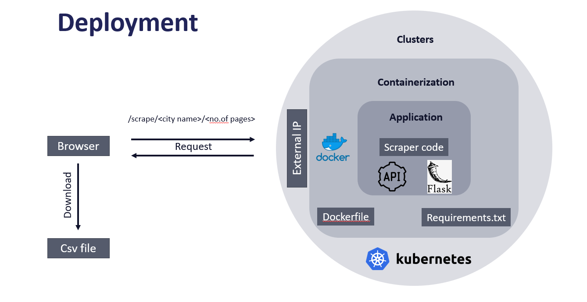
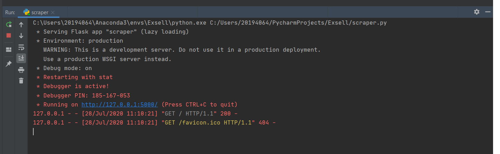
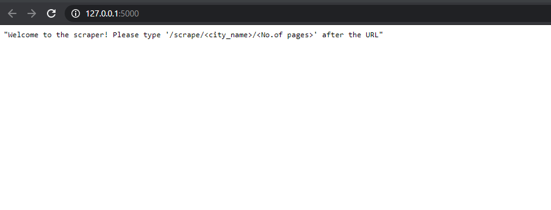
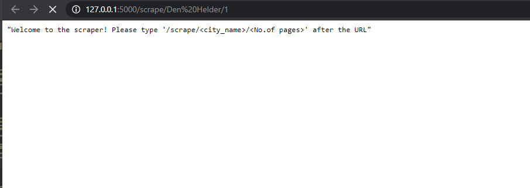
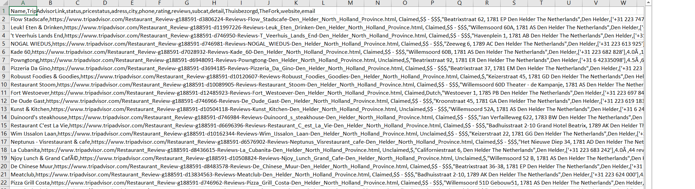

# TripAdvisor_scraper

A simple TripAdvisor scraper flask app, that will help you to scrape all the details about restaurants in the Netherlands. The details include Name, Location, Rating, No.of reviews, Cuisine type, Website of the restaurant, Email, Phone number, etc. The packages used to scrape are BeautifulSoup and Selenium. Selenium is used to scrape the website and email information of the restaurant and BeauitfulSoup is used to scrape the rest of the details.

Then the code is wrapped into an application with the help of the Flask package. Once the application was created it is then containerized with the help of Docker, deployed on the Kubernetes cluster and exposed to the outside world with the help of the Kubernetes external IP address.

- Deployment

When the application is run, it will show a simple welcome page with instructions on how to scrape. For example: when you type '/scrape/Amsterdam/2', (syntax - 'URL/scrape//<no.of pages>') the application will scrape the first two pages of the TripAdvisor list of the restaurants in the city of Amsterdam. Once it is scrapped, the output will be downloaded as a CSV file to your hard disk.

- Running the script locally

- Welcome page 

- Scraping a specific city

- Downloaded CSV file

